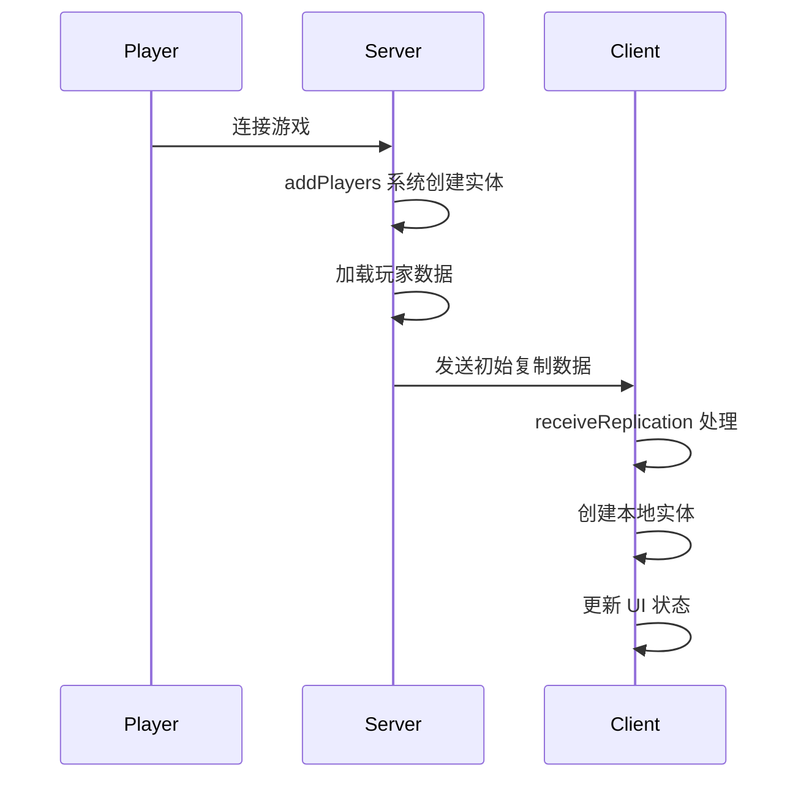
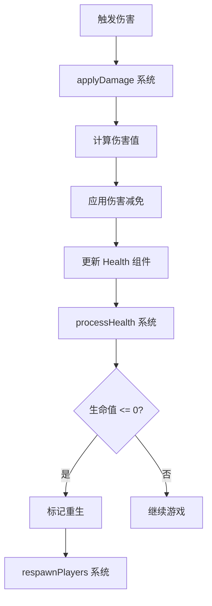
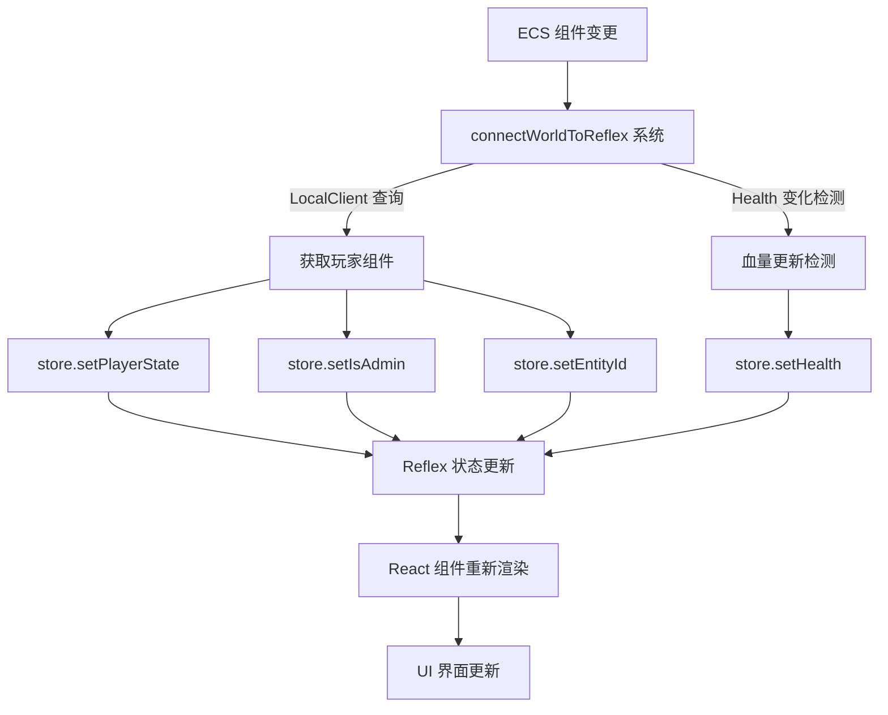

# Roblox TypeScript Matter ECS 项目架构文档

## 目录

1. [项目概述](#项目概述)
2. [技术栈分析](#技术栈分析)
3. [架构设计模式](#架构设计模式)
4. [目录结构说明](#目录结构说明)
5. [核心系统交互](#核心系统交互)
6. [开发工作流](#开发工作流)

## 项目概述

### 项目简介

这是一个基于 Roblox TypeScript 的多人游戏项目，采用 Matter ECS（Entity Component System）架构模式，结合 React UI 框架和 Reflex 状态管理库，实现了高性能、可扩展的游戏架构。项目支持客户端-服务器分离架构，提供实时网络同步和热重载开发体验。

### 核心特性

- **ECS 架构模式**：使用 Matter 库实现数据驱动的游戏逻辑
- **TypeScript 支持**：通过 roblox-ts 编译器提供完整的类型安全
- **React UI 系统**：基于 React 的声明式 UI 开发
- **状态管理**：使用 Reflex 进行客户端状态管理
- **网络复制**：通过 Zap 实现高效的客户端-服务器通信
- **热重载**：使用 Rewire 支持开发时的热模块替换
- **调试工具**：集成 Plasma 调试器和自定义调试界面

### 项目定位

本项目作为一个最小化的游戏框架模板，提供了构建大型多人 Roblox 游戏所需的基础架构。它展示了如何将现代 Web 开发技术栈（TypeScript、React、状态管理）与游戏开发最佳实践（ECS、网络同步）相结合。

## 技术栈分析

### 核心依赖

#### 游戏架构层

1. **@rbxts/matter (0.8.1)**
   - ECS 架构的核心实现
   - 提供 World、System、Component 抽象
   - 支持查询系统和变更检测
   - 实现高性能的实体管理

2. **@rbxts/plasma (0.4.5)**
   - Matter 的调试可视化工具
   - 提供运行时组件检查器
   - 支持实体关系可视化
   - 集成性能分析工具

#### UI 框架层

1. **@rbxts/react (0.3.3) + @rbxts/react-roblox (0.3.3)**
   - React 在 Roblox 平台的实现
   - 提供虚拟 DOM 和组件生命周期
   - 支持 Hooks 和函数组件
   - 实现声明式 UI 开发模式

2. **@rbxts/reflex (4.3.1) + @rbxts/react-reflex (0.3.4)**
   - Redux 风格的状态管理库
   - 提供单向数据流
   - 支持中间件和时间旅行调试
   - React 绑定实现响应式更新

#### 网络通信层

1. **Zap (通过 config.zap 配置)**
   - 类型安全的 RPC 框架
   - 自动生成网络代码
   - 支持可靠和不可靠传输
   - 实现高效的序列化

#### 开发工具层

1. **@rbxts/rewire (0.3.0)**
   - 热模块替换系统
   - 支持运行时代码更新
   - 保持游戏状态不变
   - 提高开发效率

2. **@rbxts/cmdr (1.12.0)**
   - 游戏内命令行系统
   - 支持自定义命令
   - 提供管理员工具
   - 集成权限管理

3. **roblox-ts (2.3.0-dev)**
   - TypeScript 到 Luau 编译器
   - 提供完整的类型检查
   - 支持最新 TypeScript 特性
   - 优化的运行时性能

### 构建工具链

1. **编译流程**
   ```
   TypeScript 源码 → roblox-ts 编译器 → Luau 代码 → Rojo 同步 → Roblox Studio
   ```

2. **关键配置文件**
   - `tsconfig.json`: TypeScript 编译配置
   - `default.project.json`: Rojo 项目映射
   - `config.zap`: 网络通信定义
   - `aftman.toml`: 工具版本管理

## 架构设计模式

### ECS (Entity Component System) 架构

#### 核心概念

1. **Entity（实体）**
   - 游戏对象的唯一标识符
   - 不包含任何数据或逻辑
   - 通过组件组合定义行为

2. **Component（组件）**
   - 纯数据容器
   - 定义实体的属性
   - 可组合和复用

3. **System（系统）**
   - 包含游戏逻辑
   - 处理具有特定组件组合的实体
   - 每帧执行，实现游戏行为

#### 实现示例

```typescript
// 组件定义 - src/shared/components/damage/health.ts
export const Health = component<{
    health: number;
    maxHealth?: number;
}>("Health");

// 系统定义 - src/server/systems/processHealth.ts
const processHealth = (world: World) => {
    for (const [id, health] of world.query(Health)) {
        if (health.health <= 0) {
            // 处理死亡逻辑
            world.insert(id, ShouldRespawn());
        }
    }
};
```

### 客户端-服务器架构

#### 网络复制机制

1. **组件复制策略**
   ```typescript
   // src/shared/components/replicated.ts
   export const REPLICATED_COMPONENTS = new Set([
       Client,    // 客户端信息
       Health,    // 生命值
       TrackSync  // 动画同步
   ]);
   
   export const REPLICATED_PLAYER_ONLY = new Set([
       DamageResistance,  // 仅复制给玩家自己
       ReceiveForce       // 物理力效果
   ]);
   ```

2. **复制流程**
   ```
   服务器组件变更 → 收集变更数据 → 序列化 → 
   网络传输 → 客户端接收 → 反序列化 → 
   更新客户端 World
   ```

#### 权威性设计

- **服务器权威**：游戏逻辑、碰撞检测、伤害计算
- **客户端预测**：移动输入、动画播放、UI 交互
- **同步机制**：服务器时间同步、状态协调

### React UI 架构

#### 组件层次结构

```
App (根组件)
├── RootProvider (全局状态提供者)
│   ├── RemProvider (响应式尺寸)
│   └── ReflexProvider (状态管理)
├── ErrorBoundary (错误边界)
├── Layer (UI 层级管理)
│   ├── PlayerStats (玩家状态显示)
│   ├── Vignette (视觉效果)
│   └── [其他 UI 组件]
```

#### 状态管理模式

1. **Store 结构**
   ```typescript
   // src/client/store/index.ts
   const store = combineProducers({
       app: appSlice,      // 应用全局状态
       player: playerSlice // 玩家相关状态
   });
   ```

2. **数据流向**
   ```
   ECS World → connectWorldToReflex 系统 → 
   Reflex Store → React 组件 → UI 更新
   ```

### 模块化设计

#### 组件模块划分

1. **基础组件** (`/shared/components/base/`)
   - Transform: 位置和旋转
   - Renderable: 渲染模型
   - Client: 客户端连接

2. **伤害系统** (`/shared/components/damage/`)
   - Health: 生命值管理
   - TakeDamage: 伤害接收
   - DamageResistance: 伤害减免

3. **玩家系统** (`/shared/components/player/`)
   - PlayerState: 玩家状态机
   - PlayerSave: 存档数据
   - PlayerAdmin: 管理员权限

4. **动画系统** (`/shared/components/animation/`)
   - SpawnAnimated: 动画生成
   - TrackSync: 动画同步

## 目录结构说明

### 源代码结构

```
src/
├── client/          # 客户端代码
│   ├── systems/     # 客户端专用系统
│   ├── store/       # Reflex 状态管理
│   ├── ui/          # React UI 组件
│   └── network.luau # 客户端网络代码
│
├── server/          # 服务器代码
│   ├── systems/     # 服务器专用系统
│   └── network.luau # 服务器网络代码
│
├── shared/          # 共享代码
│   ├── components/  # ECS 组件定义
│   ├── systems/     # 共享系统
│   ├── constants/   # 常量定义
│   └── utils/       # 工具函数
│
└── replicatedFirst/ # 加载屏幕
```

### 编译输出结构

```
out/
├── client/          # 编译后的客户端代码
├── server/          # 编译后的服务器代码
├── shared/          # 编译后的共享代码
└── replicatedFirst/ # 编译后的加载代码
```

### UI 组件组织

```
client/ui/
├── app/             # 应用根组件
├── components/      # 基础 UI 组件
│   ├── button/      # 按钮组件
│   ├── frame/       # 框架组件
│   ├── text/        # 文本组件
│   └── ...
├── containers/      # 容器组件
├── hooks/           # 自定义 Hooks
├── providers/       # Context 提供者
└── constants/       # UI 常量
```

## 核心系统交互

### 启动流程

#### 服务器启动

```typescript
// src/server/index.server.ts
1. 初始化 GameAnalytics
2. 注册 Cmdr 命令系统
3. 创建 ECS World
4. 加载系统模块
5. 启动游戏循环
```

#### 客户端启动

```typescript
// src/client/main.client.ts
1. 初始化 GameAnalytics
2. 预加载客户端资源
3. 发送 ConfirmLoaded 事件
4. 创建 ECS World
5. 初始化 React UI
6. 启动游戏循环
```

### 玩家连接流程



### 伤害系统交互



### UI 状态同步

#### 核心同步系统：connectWorldToReflex

`src/client/systems/connectWorldToReflex.ts` 是连接 ECS 世界与 Reflex 状态管理的桥梁系统，负责将 Matter 组件数据实时同步到 UI 状态中。

**系统执行流程：**

```typescript
// 1. 查询本地玩家实体
for (const [id, client] of world.query(LocalClient)) {
    const state = world.get(id, PlayerState);
    const admin = world.get(id, PlayerAdmin);
    
    // 2. 同步玩家状态到 Reflex
    if (state !== undefined) {
        store.setPlayerState(state.state);
    }
    
    // 3. 同步管理员权限
    if (admin !== undefined) {
        store.setIsAdmin(true);
    }
    
    // 4. 更新实体ID
    store.setEntityId(id);
}

// 5. 监听血量变化并实时同步
for (const [id, health] of world.queryChanged(Health)) {
    if (id === localPlayerId && health.new !== undefined) {
        store.setHealth(health.new.health);
    }
}
```

**关键特性：**

- **高优先级执行**：`SystemPriority.HIGH` 确保状态及时同步
- **变化检测优化**：使用 `queryChanged()` 只在数据变化时更新
- **本地玩家过滤**：仅同步与本地玩家相关的数据
- **安全性检查**：验证实体存在性 `world.contains(id)`

**数据流向示例：**



**同步的状态类型：**

1. **App 状态** (`appSlice`)：
   - `playerState` - 玩家游戏状态 (连接/游戏中/死亡等)
   - `isAdmin` - 管理员权限标识
   - `entityId` - ECS 实体 ID

2. **Player 状态** (`playerSlice`)：
   - `health` - 玩家当前血量

这种设计实现了 ECS 世界与 UI 状态的完全解耦，UI 组件通过 Reflex 获取状态而不直接查询 ECS 世界，保证了架构的清晰性和性能优化。

### 网络复制详细流程

#### 服务器端复制系统

```typescript
// src/server/systems/replication.ts
1. 监听组件变更 (queryChanged)
2. 收集需要复制的组件
3. 按玩家分组打包数据
4. 通过 Zap 发送到客户端
```

#### 客户端接收处理

```typescript
// src/client/receiveReplication.ts
1. 接收服务器数据包
2. 解析组件更新
3. 映射服务器实体到客户端实体
4. 应用组件更新到本地 World
```

## 开发工作流

### 环境配置

#### 必需工具

1. **Node.js**: 运行 TypeScript 编译器
2. **Aftman**: Roblox 工具链管理
3. **Rojo**: 文件系统同步
4. **Roblox Studio**: 游戏开发环境

#### 环境变量

```bash
# .env 文件配置
ENV=development                    # 环境模式
GROUP_ID=123456                    # Roblox 群组 ID
BUILD_VERSION=0.0.1               # 构建版本
GAME_ANALYTICS_GAME_KEY=xxx       # GameAnalytics 密钥
GAME_ANALYTICS_SECRET_KEY=xxx     # GameAnalytics 密钥
```

### 开发命令

```json
{
  "scripts": {
    "start": "npx rbxtsc -w",        // 监听模式编译
    "build": "npx rbxtsc",           // 生产构建
    "rojo": "rojo serve",            // 启动 Rojo 服务器
    "watch": "concurrently ...",     // 并行运行开发服务
    "zap": "zap ./config.zap"        // 生成网络代码
  }
}
```

### 开发流程

#### 1. 添加新组件

```typescript
// src/shared/components/myFeature/myComponent.ts
import { component } from "@rbxts/matter";

export const MyComponent = component<{
    value: number;
    name: string;
}>("MyComponent");

// 导出到 index.ts
export * from "./myComponent";
```

#### 2. 创建新系统

```typescript
// src/server/systems/mySystem.ts
import { World } from "@rbxts/matter";
import { MyComponent } from "shared/components";

const mySystem = (world: World) => {
    for (const [id, comp] of world.query(MyComponent)) {
        // 系统逻辑
    }
};

export = {
    system: mySystem,
    priority: 0,  // 可选：系统优先级
};
```

#### 3. 添加 UI 组件

```tsx
// src/client/ui/components/myUI/myUI.tsx
import React from "@rbxts/react";

interface MyUIProps {
    text: string;
}

export const MyUI: React.FC<MyUIProps> = ({ text }) => {
    return (
        <textlabel
            Text={text}
            Size={new UDim2(0, 200, 0, 50)}
        />
    );
};
```

#### 4. 网络通信扩展

```zap
// config.zap
event MyCustomEvent = {
    from: Client,
    type: Reliable,
    call: ManyAsync,
    data: struct {
        action: string,
        value: f32
    }
}
```

### 调试技巧

#### 1. Matter 调试器

- 按 F4 键（Studio 中）打开调试器
- 使用 `/matter` 命令（游戏中）
- 查看实体和组件状态
- 监控系统性能

#### 2. 热重载使用

```typescript
// 系统会自动检测文件变更
// 保持游戏状态的同时更新代码
// 仅在开发环境启用
if (!production) {
    hotReloader.scan(container, loadModule, unloadModule);
}
```

#### 3. 日志和追踪

```typescript
import { log } from "@rbxts/matter";

// 在系统中使用
log("System Name", "Event", data);

// 条件日志
if (debugEnabled) {
    print("Debug:", ...args);
}
```

### 性能优化建议

#### 1. 组件设计

- **保持组件小而专注**：每个组件只负责一个方面
- **避免深层嵌套**：扁平化数据结构
- **使用标记组件**：无数据的组件作为标记

#### 2. 系统优化

- **使用查询缓存**：避免重复查询
- **批处理操作**：减少单独的 World 操作
- **优先级管理**：合理设置系统执行顺序

#### 3. 网络优化

- **选择性复制**：只复制必要的组件
- **批量发送**：累积变更后统一发送
- **压缩数据**：使用紧凑的数据格式

### 部署准备

#### 1. 生产构建

```bash
# 设置环境变量
ENV=production

# 执行构建
npm run build

# 生成 rbxl 文件
rojo build -o game.rbxl
```

#### 2. 性能监控

- 集成 GameAnalytics 追踪
- 自定义性能指标
- 错误报告系统

#### 3. 版本管理

```typescript
// 使用环境变量管理版本
const build = $env.string("BUILD_VERSION") ?? "0.0.1";
```

## 扩展指南

### 添加新功能模块

1. **规划组件结构**
   - 识别需要的数据
   - 设计组件接口
   - 考虑复制需求

2. **实现系统逻辑**
   - 创建处理系统
   - 设置执行优先级
   - 处理边界情况

3. **集成 UI 展示**
   - 创建 React 组件
   - 连接 Reflex 状态
   - 添加用户交互

4. **测试和优化**
   - 单元测试组件
   - 集成测试系统
   - 性能分析优化

### 最佳实践总结

1. **架构原则**
   - 数据与逻辑分离（ECS）
   - 单向数据流（Reflex）
   - 组件化开发（React）

2. **代码组织**
   - 模块化文件结构
   - 清晰的命名规范
   - 适当的代码注释

3. **性能考虑**
   - 最小化网络传输
   - 优化渲染批次
   - 合理的更新频率

4. **开发体验**
   - 利用热重载
   - 使用调试工具
   - 维护开发文档

## 总结

本项目展示了一个现代化的 Roblox 游戏开发架构，通过结合 ECS 模式、React UI、TypeScript 类型系统和高效的网络同步机制，提供了一个可扩展、可维护的游戏开发框架。该架构适合构建中大型多人在线游戏，特别是需要复杂状态管理和实时同步的游戏项目。

关键优势：
- **类型安全**：TypeScript 提供编译时类型检查
- **模块化**：清晰的代码组织和职责分离
- **性能优化**：ECS 架构提供高效的数据处理
- **开发效率**：热重载和调试工具提升开发体验
- **可扩展性**：易于添加新功能和系统

通过遵循本文档中的架构模式和最佳实践，开发者可以快速构建高质量的 Roblox 游戏项目。